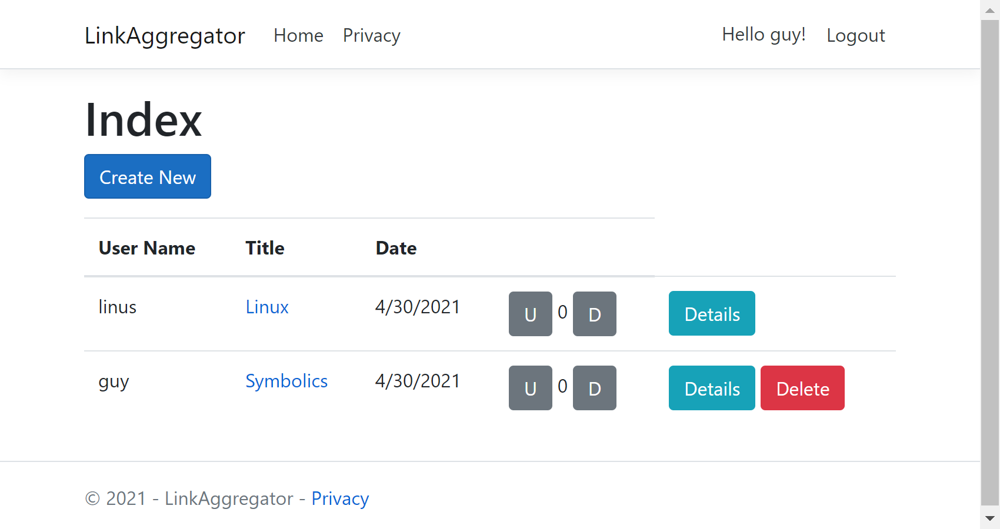

# LinkAggregator

## Introduction

This document provides steps on how to build a simple link aggregator site in ASP.NET Core Pages.

Here's what the link list looks like:



Currently implemented features:

- Multiple users
- Voting
- Authorization
- Comments

Currently only tested on Windows.

This tutorial assumes that you've worked through some simple ASP.NET Core examples already. 
So, it doesn't explain every little detail along the way.
In this sense, it's more of a step-by-step cookbook recipe-style guide.

## About this document

This tutorial was generated from a [source file](LinkAggregatorTutorial.ps1) written in PowerShell.
The script that converts the PowerShell source file to markdown is [here](https://github.com/dharmatech/LinkAggregatorTutorial/blob/main/ConvertToMarkdown.ps1).

That source file, when executed, will go through all the steps shown in this tutorial.
Thus the tutorial can always be validated to make sure that the steps are working properly by running the source file.
Feel free to run the source file before going through the tutorial to verify that the tutorial works on your system.

Here are the steps that you can run to test the source file. In a PowerShell window:

    cd C:\Temp 
    git clone https://github.com/dharmatech/LinkAggregatorTutorial.git
    cd LinkAggregatorTutorial

Edit the `LinkAggregatorTutorial.ps1` file:

    code .\LinkAggregatorTutorial.ps1

Change the line that looks like the following:

    cd C:\Users\dharm\Dropbox\Documents\VisualStudio\LinkAggregatorTutorial

to some directory on your system that you want the resulting project to be located in. So for example:

    cd C:\Temp\LinkAggregatorTutorial

Run the source file:

    .\LinkAggregatorTutorial.ps1

This currently takes around 2 minutes to complete on my system.

### Navigating this document

If you are reading this document on github, you can select the dropdown menu to the left of the line count to view the table of contents:


## Feedback

If you feel that some aspect of the project could be built in a better way, feel free to leave an issue.

If you notice any issue with the tutorial itself, also feel free to leave an issue.


# Project

Go to the directory where our project will be created.
        
    cd C:\Users\dharm\Dropbox\Documents\VisualStudio\LinkAggregatorTutorial


## Create project directory

    New-Item -ItemType Directory -Name LinkAggregator

    cd LinkAggregator

## Create project

    dotnet new webapp --auth Individual --use-local-db

    dotnet new gitignore

    git init

    git add . 

    git commit --message 'Initial checkin'
----------------------------------------------------------------------

# Links

## `Link` model class for storing links

Create the `Models\Link.cs` file.

The text below is in diff format. The actual file contents of `Link.cs` start below the line that looks like `@@ -0,0 +1,12 @@`.

```diff 
diff --git a/Models/Link.cs b/Models/Link.cs
new file mode 100644
index 0000000..29de407
--- /dev/null
+++ b/Models/Link.cs
@@ -0,0 +1,12 @@
+using System;
+
+namespace LinkAggregator.Models
+{
+    public class Link
+    {
+        public int Id { get; set; }
+        public string UserId { get; set; }
+        public string Url { get; set; }
+        public DateTime DateTime { get; set; }
+    }
+}
```

    git add . ; git commit --message 'Add Link.cs'
----------------------------------------------------------------------

## Generate pages for `Link`

    dotnet add package Microsoft.VisualStudio.Web.CodeGeneration.Design

    dotnet tool install --global dotnet-aspnet-codegenerator

    dotnet aspnet-codegenerator razorpage `
        -m Link `
        --useDefaultLayout `
        --dataContext        ApplicationDbContext `
        --relativeFolderPath Pages\Links `
        --referenceScriptLibraries
    
    dotnet ef database drop -f

    dotnet ef migrations add Initial

    dotnet ef database update

    git add . ; git commit --message 'Add Link pages via scaffolding'
----------------------------------------------------------------------

Change encoding of `_Layout.cshtml`:

    (Get-Content .\Pages\Shared\_Layout.cshtml) | Set-Content .\Pages\Shared\_Layout.cshtml

    git add . ; git commit --message 'encoding'
----------------------------------------------------------------------

Update LinkAggregator anchor

```diff 
diff --git a/Pages/Shared/_Layout.cshtml b/Pages/Shared/_Layout.cshtml
index 0465ef6..bdbe9ce 100644
--- a/Pages/Shared/_Layout.cshtml
+++ b/Pages/Shared/_Layout.cshtml
@@ -11,7 +11,7 @@
     <header>
         <nav class="navbar navbar-expand-sm navbar-toggleable-sm navbar-light bg-white border-bottom box-shadow mb-3">
             <div class="container">
-                <a class="navbar-brand" asp-area="" asp-page="/Index">LinkAggregator</a>
+                <a class="navbar-brand" asp-area="" asp-page="/Links/Index">LinkAggregator</a>
                 <button class="navbar-toggler" type="button" data-toggle="collapse" data-target=".navbar-collapse" aria-controls="navbarSupportedContent"
                         aria-expanded="false" aria-label="Toggle navigation">
                     <span class="navbar-toggler-icon"></span>
```

    git add . ; git commit --message 'Update LinkAggregator anchor'
----------------------------------------------------------------------


## Adding new links

A user that isn't logged in can add an entry.

Let's make it so that only logged in users can add links.

```diff 
diff --git a/Pages/Links/Create.cshtml.cs b/Pages/Links/Create.cshtml.cs
index fed813d..f1ee9d0 100644
--- a/Pages/Links/Create.cshtml.cs
+++ b/Pages/Links/Create.cshtml.cs
@@ -24,6 +24,9 @@ namespace LinkAggregator.Pages.Links
 
         public IActionResult OnGet()
         {
+            if (User.Identity.Name == null)
+                return RedirectToPage("./Index");
+
             return Page();
         }
 

```

    git add . ; git commit --message 'User must be logged in to add a link'
----------------------------------------------------------------------

## Identity pages

Scaffold out the identity pages

    dotnet add package Microsoft.VisualStudio.Web.CodeGeneration.Design
    dotnet add package Microsoft.EntityFrameworkCore.Design
    dotnet add package Microsoft.AspNetCore.Identity.EntityFrameworkCore
    dotnet add package Microsoft.AspNetCore.Identity.UI
    dotnet add package Microsoft.EntityFrameworkCore.SqlServer
    dotnet add package Microsoft.EntityFrameworkCore.Tools

    dotnet aspnet-codegenerator identity `
        --dbContext LinkAggregator.Data.ApplicationDbContext

    git add . ; git commit --message 'Identity pages'

----------------------------------------------------------------------

## Create form - remove `UserId`

The 'Create' form has a field for `UserId`. We shouldn't have to enter this. Let's remove this field.

----------------------------------------------------------------------
Add `UserManager` to `CreateModel`

```diff 
diff --git a/Pages/Links/Create.cshtml.cs b/Pages/Links/Create.cshtml.cs
index 2056883..9dd7fe7 100644
--- a/Pages/Links/Create.cshtml.cs
+++ b/Pages/Links/Create.cshtml.cs
@@ -7,16 +7,19 @@ using Microsoft.AspNetCore.Mvc.RazorPages;
 using Microsoft.AspNetCore.Mvc.Rendering;
 using LinkAggregator.Data;
 using LinkAggregator.Models;
+using Microsoft.AspNetCore.Identity;
 
 namespace LinkAggregator.Pages.Links
 {
     public class CreateModel : PageModel
     {
-        private readonly LinkAggregator.Data.ApplicationDbContext _context;
+        private readonly ApplicationDbContext _context;
+        private UserManager<IdentityUser> UserManager { get; }
 
-        public CreateModel(LinkAggregator.Data.ApplicationDbContext context)
+        public CreateModel(ApplicationDbContext context, UserManager<IdentityUser> userManager)
         {
             _context = context;
+            UserManager = userManager;
         }
 
         public IActionResult OnGet()
```

    git add . ; git commit --message 'Pages\Links\Create.cshtml.cs - UserManager'
----------------------------------------------------------------------
Populate `Link.UserId` automatically with id of current user.

```diff 
diff --git a/Pages/Links/Create.cshtml.cs b/Pages/Links/Create.cshtml.cs
index 9dd7fe7..fed813d 100644
--- a/Pages/Links/Create.cshtml.cs
+++ b/Pages/Links/Create.cshtml.cs
@@ -38,6 +38,8 @@ namespace LinkAggregator.Pages.Links
                 return Page();
             }
 
+            Link.UserId = UserManager.GetUserId(User);
+
             _context.Link.Add(Link);
             await _context.SaveChangesAsync();
 
```

    git add . ; git commit --message 'Pages\Links\Create.cshtml.cs - populate UserId field'
----------------------------------------------------------------------

Remove UserId field from create form frontend.

```diff 
diff --git a/Pages/Links/Create.cshtml b/Pages/Links/Create.cshtml
index 7ac2d77..a12e5c6 100644
--- a/Pages/Links/Create.cshtml
+++ b/Pages/Links/Create.cshtml
@@ -13,11 +13,7 @@
     <div class="col-md-4">
         <form method="post">
             <div asp-validation-summary="ModelOnly" class="text-danger"></div>
-            <div class="form-group">
-                <label asp-for="Link.UserId" class="control-label"></label>
-                <input asp-for="Link.UserId" class="form-control" />
-                <span asp-validation-for="Link.UserId" class="text-danger"></span>
-            </div>
+            
             <div class="form-group">
                 <label asp-for="Link.Url" class="control-label"></label>
                 <input asp-for="Link.Url" class="form-control" />
```

    git add . ; git commit --message 'Pages\Links\Create.cshtml - remove UserId field'
----------------------------------------------------------------------

## Create form: remove `DateTime`

The create form has a field for `DateTime`.

It's a field for storing the time that the link was created.

The user shouldn't have to fill this in.

----------------------------------------------------------------------
```diff 
diff --git a/Pages/Links/Create.cshtml.cs b/Pages/Links/Create.cshtml.cs
index fed813d..a8b0f67 100644
--- a/Pages/Links/Create.cshtml.cs
+++ b/Pages/Links/Create.cshtml.cs
@@ -40,6 +40,8 @@ namespace LinkAggregator.Pages.Links
 
             Link.UserId = UserManager.GetUserId(User);
 
+            Link.DateTime = DateTime.Now;
+
             _context.Link.Add(Link);
             await _context.SaveChangesAsync();
 
```
----------------------------------------------------------------------
```diff 
diff --git a/Pages/Links/Create.cshtml b/Pages/Links/Create.cshtml
index a12e5c6..0f7a2d7 100644
--- a/Pages/Links/Create.cshtml
+++ b/Pages/Links/Create.cshtml
@@ -19,11 +19,7 @@
                 <input asp-for="Link.Url" class="form-control" />
                 <span asp-validation-for="Link.Url" class="text-danger"></span>
             </div>
-            <div class="form-group">
-                <label asp-for="Link.DateTime" class="control-label"></label>
-                <input asp-for="Link.DateTime" class="form-control" />
-                <span asp-validation-for="Link.DateTime" class="text-danger"></span>
-            </div>
+            
             <div class="form-group">
                 <input type="submit" value="Create" class="btn btn-primary" />
             </div>
```

    git add . ; git commit --message 'Create form - remove field for DateTime'
----------------------------------------------------------------------

## Link model: add field for `Title`

Currently, the user can only supply a url when adding a link.
Most link aggregation sites allow the user to provide a title.
Let's add a field for the link title.

```diff 
diff --git a/Models/Link.cs b/Models/Link.cs
index 29de407..65cc4c4 100644
--- a/Models/Link.cs
+++ b/Models/Link.cs
@@ -7,6 +7,7 @@ namespace LinkAggregator.Models
         public int Id { get; set; }
         public string UserId { get; set; }
         public string Url { get; set; }
+        public string Title { get; set; }
         public DateTime DateTime { get; set; }
     }
 }
```

    git add . ; git commit --message 'Models\Link.cs - Title field'
----------------------------------------------------------------------
    dotnet ef migrations add AddLinkTitle
    dotnet ef database update

    git add . ; git commit --message 'dotnet ef migrations add AddLinkTitle'
----------------------------------------------------------------------
```diff 
diff --git a/Pages/Links/Create.cshtml b/Pages/Links/Create.cshtml
index 0f7a2d7..f81ef90 100644
--- a/Pages/Links/Create.cshtml
+++ b/Pages/Links/Create.cshtml
@@ -13,13 +13,19 @@
     <div class="col-md-4">
         <form method="post">
             <div asp-validation-summary="ModelOnly" class="text-danger"></div>
-            
+
+            <div class="form-group">
+                <label asp-for="Link.Title" class="control-label"></label>
+                <input asp-for="Link.Title" class="form-control"></input>
+                <span asp-validation-for="Link.Title" class="text-danger"></span>
+            </div>
+
             <div class="form-group">
                 <label asp-for="Link.Url" class="control-label"></label>
                 <input asp-for="Link.Url" class="form-control" />
                 <span asp-validation-for="Link.Url" class="text-danger"></span>
             </div>
-            
+
             <div class="form-group">
                 <input type="submit" value="Create" class="btn btn-primary" />
             </div>
```

    git add . ; git commit --message 'Pages\Links\Create.cshtml - add field for Title'
----------------------------------------------------------------------
```diff 
diff --git a/Pages/Links/Index.cshtml b/Pages/Links/Index.cshtml
index 4e46774..dfffe05 100644
--- a/Pages/Links/Index.cshtml
+++ b/Pages/Links/Index.cshtml
@@ -16,6 +16,9 @@
             <th>
                 @Html.DisplayNameFor(model => model.Link[0].UserId)
             </th>
+            <th>
+                @Html.DisplayNameFor(model => model.Link[0].Title)
+            </th>
             <th>
                 @Html.DisplayNameFor(model => model.Link[0].Url)
             </th>
@@ -31,6 +34,11 @@
             <td>
                 @Html.DisplayFor(modelItem => item.UserId)
             </td>
+
+            <td>
+                @Html.DisplayFor(modelItem => item.Title)
+            </td>
+
             <td>
                 @Html.DisplayFor(modelItem => item.Url)
             </td>
```

    git add . ; git commit --message 'Pages\Links\Index.cshtml - add field for Title'
----------------------------------------------------------------------

Add title to details page

```diff 
diff --git a/Pages/Links/Details.cshtml b/Pages/Links/Details.cshtml
index e4c1c67..37ade6b 100644
--- a/Pages/Links/Details.cshtml
+++ b/Pages/Links/Details.cshtml
@@ -17,6 +17,12 @@
         <dd class="col-sm-10">
             @Html.DisplayFor(model => model.Link.UserId)
         </dd>
+        <dt class="col-sm-2">
+            @Html.DisplayNameFor(model => model.Link.Title)
+        </dt>
+        <dd class="col-sm-10">
+            @Html.DisplayFor(model => model.Link.Title)
+        </dd>
         <dt class="col-sm-2">
             @Html.DisplayNameFor(model => model.Link.Url)
         </dt>

```

    git add . ; git commit --message 'Pages\Links\Details.cshtml - add field for Title'
----------------------------------------------------------------------

## Link index: Only show title

Link aggregation sites don't usually display the full URL in the link list.

Let's remove the URL from the link list page.

```diff 
diff --git a/Pages/Links/Index.cshtml b/Pages/Links/Index.cshtml
index dfffe05..ea221d2 100644
--- a/Pages/Links/Index.cshtml
+++ b/Pages/Links/Index.cshtml
@@ -19,9 +19,6 @@
             <th>
                 @Html.DisplayNameFor(model => model.Link[0].Title)
             </th>
-            <th>
-                @Html.DisplayNameFor(model => model.Link[0].Url)
-            </th>
             <th>
                 @Html.DisplayNameFor(model => model.Link[0].DateTime)
             </th>
@@ -39,9 +36,6 @@
                 @Html.DisplayFor(modelItem => item.Title)
             </td>
 
-            <td>
-                @Html.DisplayFor(modelItem => item.Url)
-            </td>
             <td>
                 @Html.DisplayFor(modelItem => item.DateTime)
             </td>
```

    git add . ; git commit --message 'Pages\Links\Index.cshtml - remove field for Url'
----------------------------------------------------------------------

## URL validation

Currently, the url field on the create form allows any value to be submitted.
Let's make it only accept properly formatted URLs.

```diff 
diff --git a/Models/Link.cs b/Models/Link.cs
index 65cc4c4..f2aebcc 100644
--- a/Models/Link.cs
+++ b/Models/Link.cs
@@ -1,4 +1,5 @@
 using System;
+using System.ComponentModel.DataAnnotations;
 
 namespace LinkAggregator.Models
 {
@@ -6,7 +7,10 @@ namespace LinkAggregator.Models
     {
         public int Id { get; set; }
         public string UserId { get; set; }
+
+        [DataType(DataType.Url)]
         public string Url { get; set; }
+
         public string Title { get; set; }
         public DateTime DateTime { get; set; }
     }
```

    git add . ; git commit --message 'Models\Link.cs - DataType.Url'
----------------------------------------------------------------------

## Link index: DateTime formatting

The DateTime field on the link list shows the time as well as the date.
Let's have it only display the date.

```diff 
diff --git a/Models/Link.cs b/Models/Link.cs
index f2aebcc..4582dea 100644
--- a/Models/Link.cs
+++ b/Models/Link.cs
@@ -12,6 +12,9 @@ namespace LinkAggregator.Models
         public string Url { get; set; }
 
         public string Title { get; set; }
+
+        [Display(Name = "Date")]
+        [DataType(DataType.Date)]
         public DateTime DateTime { get; set; }
     }
 }
```

    git add . ; git commit --message 'Models\Link.cs - DataType.Date for DateTime'
----------------------------------------------------------------------

## Adding support for usernames

Users have usernames on most link aggregation sites.
Currently, when a new user registers, they are only asked for an email address and this is used as their username.
Let's have the user supply a username in addition to their email address.

```diff 
diff --git a/Areas/Identity/Pages/Account/Register.cshtml.cs b/Areas/Identity/Pages/Account/Register.cshtml.cs
index 3c92469..08d916e 100644
--- a/Areas/Identity/Pages/Account/Register.cshtml.cs
+++ b/Areas/Identity/Pages/Account/Register.cshtml.cs
@@ -45,6 +45,11 @@ namespace LinkAggregator.Areas.Identity.Pages.Account
 
         public class InputModel
         {
+            [Required]
+            [DataType(DataType.Text)]
+            [Display(Name = "User Name")]
+            public string UserName { get; set; }
+
             [Required]
             [EmailAddress]
             [Display(Name = "Email")]
@@ -74,7 +79,7 @@ namespace LinkAggregator.Areas.Identity.Pages.Account
             ExternalLogins = (await _signInManager.GetExternalAuthenticationSchemesAsync()).ToList();
             if (ModelState.IsValid)
             {
-                var user = new IdentityUser { UserName = Input.Email, Email = Input.Email };
+                var user = new IdentityUser { UserName = Input.UserName, Email = Input.Email };
                 var result = await _userManager.CreateAsync(user, Input.Password);
                 if (result.Succeeded)
                 {
```

    git add . ; git commit --message 'Register.cshtml.cs - Username'
----------------------------------------------------------------------
```diff 
diff --git a/Areas/Identity/Pages/Account/Register.cshtml b/Areas/Identity/Pages/Account/Register.cshtml
index 96e6a9a..efa8667 100644
--- a/Areas/Identity/Pages/Account/Register.cshtml
+++ b/Areas/Identity/Pages/Account/Register.cshtml
@@ -12,6 +12,13 @@
             <h4>Create a new account.</h4>
             <hr />
             <div asp-validation-summary="All" class="text-danger"></div>
+
+            <div class="form-group">
+                <label asp-for="Input.UserName"></label>
+                <input asp-for="Input.UserName" class="form-control" />
+                <span asp-validation-for="Input.UserName" class="text-danger"></span>
+            </div>
+
             <div class="form-group">
                 <label asp-for="Input.Email"></label>
                 <input asp-for="Input.Email" class="form-control" />
```

    git add . ; git commit --message 'Register.cshtml - Username'
----------------------------------------------------------------------
```diff 
diff --git a/Areas/Identity/Pages/Account/Login.cshtml.cs b/Areas/Identity/Pages/Account/Login.cshtml.cs
index 3d0719d..54c64a8 100644
--- a/Areas/Identity/Pages/Account/Login.cshtml.cs
+++ b/Areas/Identity/Pages/Account/Login.cshtml.cs
@@ -43,8 +43,9 @@ namespace LinkAggregator.Areas.Identity.Pages.Account
         public class InputModel
         {
             [Required]
-            [EmailAddress]
-            public string Email { get; set; }
+            [DataType(DataType.Text)]
+            [Display(Name = "User Name")]
+            public string UserName { get; set; }
 
             [Required]
             [DataType(DataType.Password)]
@@ -81,7 +82,7 @@ namespace LinkAggregator.Areas.Identity.Pages.Account
             {
                 // This doesn't count login failures towards account lockout
                 // To enable password failures to trigger account lockout, set lockoutOnFailure: true
-                var result = await _signInManager.PasswordSignInAsync(Input.Email, Input.Password, Input.RememberMe, lockoutOnFailure: false);
+                var result = await _signInManager.PasswordSignInAsync(Input.UserName, Input.Password, Input.RememberMe, lockoutOnFailure: false);
                 if (result.Succeeded)
                 {
                     _logger.LogInformation("User logged in.");
```

    git add . ; git commit --message 'Login.cshtml.cs - UserName'
----------------------------------------------------------------------
```diff 
diff --git a/Areas/Identity/Pages/Account/Login.cshtml b/Areas/Identity/Pages/Account/Login.cshtml
index 72a567f..6d374b9 100644
--- a/Areas/Identity/Pages/Account/Login.cshtml
+++ b/Areas/Identity/Pages/Account/Login.cshtml
@@ -14,9 +14,9 @@
                 <hr />
                 <div asp-validation-summary="All" class="text-danger"></div>
                 <div class="form-group">
-                    <label asp-for="Input.Email"></label>
-                    <input asp-for="Input.Email" class="form-control" />
-                    <span asp-validation-for="Input.Email" class="text-danger"></span>
+                    <label asp-for="Input.UserName"></label>
+                    <input asp-for="Input.UserName" class="form-control" />
+                    <span asp-validation-for="Input.UserName" class="text-danger"></span>
                 </div>
                 <div class="form-group">
                     <label asp-for="Input.Password"></label>
```

    git add . ; git commit --message 'Login.cshtml - UserName'
----------------------------------------------------------------------

The links list currently shows a UserId for each link.
Let's display the username instead.

```diff 
diff --git a/Pages/Links/Index.cshtml.cs b/Pages/Links/Index.cshtml.cs
index c2ac2a5..aa27ac4 100644
--- a/Pages/Links/Index.cshtml.cs
+++ b/Pages/Links/Index.cshtml.cs
@@ -7,20 +7,25 @@ using Microsoft.AspNetCore.Mvc.RazorPages;
 using Microsoft.EntityFrameworkCore;
 using LinkAggregator.Data;
 using LinkAggregator.Models;
+using Microsoft.AspNetCore.Identity;
 
 namespace LinkAggregator.Pages.Links
 {
     public class IndexModel : PageModel
     {
-        private readonly LinkAggregator.Data.ApplicationDbContext _context;
+        private readonly ApplicationDbContext _context;
+        private UserManager<IdentityUser> UserManager { get; }
 
-        public IndexModel(LinkAggregator.Data.ApplicationDbContext context)
+        public IndexModel(ApplicationDbContext context, UserManager<IdentityUser> userManager)
         {
             _context = context;
+            UserManager = userManager;
         }
 
         public IList<Link> Link { get;set; }
 
+        public IdentityUser LinkUser(Link link) => UserManager.FindByIdAsync(link.UserId).Result;
+
         public async Task OnGetAsync()
         {
             Link = await _context.Link.ToListAsync();
```

    git add . ; git commit --message 'Login.cshtml.cs - LinkUser method'
----------------------------------------------------------------------
```diff 
diff --git a/Pages/Links/Index.cshtml b/Pages/Links/Index.cshtml
index ea221d2..23d0564 100644
--- a/Pages/Links/Index.cshtml
+++ b/Pages/Links/Index.cshtml
@@ -14,7 +14,7 @@
     <thead>
         <tr>
             <th>
-                @Html.DisplayNameFor(model => model.Link[0].UserId)
+                User Name
             </th>
             <th>
                 @Html.DisplayNameFor(model => model.Link[0].Title)
@@ -29,7 +29,7 @@
 @foreach (var item in Model.Link) {
         <tr>
             <td>
-                @Html.DisplayFor(modelItem => item.UserId)
+                @Html.DisplayFor(modelItem => Model.LinkUser(item).UserName)
             </td>
 
             <td>
```

    git add . ; git commit --message 'Login.cshtml - UserName'
----------------------------------------------------------------------

## Clickable title

Let's make the title a clickable link on the link list

```diff 
diff --git a/Pages/Links/Index.cshtml b/Pages/Links/Index.cshtml
index 23d0564..d110e0c 100644
--- a/Pages/Links/Index.cshtml
+++ b/Pages/Links/Index.cshtml
@@ -33,7 +33,9 @@
             </td>
 
             <td>
-                @Html.DisplayFor(modelItem => item.Title)
+                <a href="@item.Url">
+                    @Html.DisplayFor(modelItem => item.Title)
+                </a>
             </td>
 
             <td>

```

    git add . ; git commit --message 'Pages\Links.cshtml - make Title clickable link'
----------------------------------------------------------------------


# Voting

Users should be able to vote on links.
Let's add this now.

----------------------------------------------------------------------

```diff 
diff --git a/Models/Vote.cs b/Models/Vote.cs
new file mode 100644
index 0000000..13d3036
--- /dev/null
+++ b/Models/Vote.cs
@@ -0,0 +1,18 @@
+using System;
+using System.Collections.Generic;
+using System.Linq;
+using System.Threading.Tasks;
+
+namespace LinkAggregator.Models
+{
+    public class Vote
+    {
+        public int Id { get; set; }
+        public string UserId { get; set; }
+        public int Score { get; set; }
+        public DateTime DateTime { get; set; }
+
+        public int LinkId { get; set; }
+        public Link Link { get; set; }
+    }
+}

```

    git add . ; git commit --message 'Models\Vote.cs'
----------------------------------------------------------------------
```diff 
diff --git a/Models/Link.cs b/Models/Link.cs
index 4582dea..5e1e9e6 100644
--- a/Models/Link.cs
+++ b/Models/Link.cs
@@ -1,4 +1,5 @@
 using System;
+using System.Collections.Generic;
 using System.ComponentModel.DataAnnotations;
 
 namespace LinkAggregator.Models
@@ -16,5 +17,7 @@ namespace LinkAggregator.Models
         [Display(Name = "Date")]
         [DataType(DataType.Date)]
         public DateTime DateTime { get; set; }
+
+        public List<Vote> Votes { get; set; }
     }
 }

```

    git add . ; git commit --message 'Link.cs - Votes navigation property'
----------------------------------------------------------------------
```diff 
diff --git a/Data/ApplicationDbContext.cs b/Data/ApplicationDbContext.cs
index f647429..cae0049 100644
--- a/Data/ApplicationDbContext.cs
+++ b/Data/ApplicationDbContext.cs
@@ -14,5 +14,7 @@ namespace LinkAggregator.Data
         {
         }
         public DbSet<LinkAggregator.Models.Link> Link { get; set; }
+
+        public DbSet<Vote> Vote { get; set; }
     }
 }
```

    git add . ; git commit --message 'ApplicationDbContext.cs - Vote'
----------------------------------------------------------------------
```diff 
diff --git a/Data/ApplicationDbContext.cs b/Data/ApplicationDbContext.cs
index cae0049..6758500 100644
--- a/Data/ApplicationDbContext.cs
+++ b/Data/ApplicationDbContext.cs
@@ -13,7 +13,7 @@ namespace LinkAggregator.Data
             : base(options)
         {
         }
-        public DbSet<LinkAggregator.Models.Link> Link { get; set; }
+        public DbSet<Link> Link { get; set; }
 
         public DbSet<Vote> Vote { get; set; }
     }

```

    git add . ; git commit --message 'ApplicationDbContext.cs - simplify reference'
----------------------------------------------------------------------
    dotnet ef migrations add Vote

    dotnet ef database update
----------------------------------------------------------------------
```diff 
diff --git a/Models/Link.cs b/Models/Link.cs
index 5e1e9e6..ce0cfba 100644
--- a/Models/Link.cs
+++ b/Models/Link.cs
@@ -1,6 +1,7 @@
 using System;
 using System.Collections.Generic;
 using System.ComponentModel.DataAnnotations;
+using System.Linq;
 
 namespace LinkAggregator.Models
 {
@@ -19,5 +20,7 @@ namespace LinkAggregator.Models
         public DateTime DateTime { get; set; }
 
         public List<Vote> Votes { get; set; }
+
+        public int Score() => Votes.Sum(vote => vote.Score);
     }
 }

```

    git add . ; git commit --message 'Link - Score method'
----------------------------------------------------------------------
```diff 
diff --git a/Pages/Links/Index.cshtml.cs b/Pages/Links/Index.cshtml.cs
index aa27ac4..c3414a9 100644
--- a/Pages/Links/Index.cshtml.cs
+++ b/Pages/Links/Index.cshtml.cs
@@ -28,7 +28,9 @@ namespace LinkAggregator.Pages.Links
 
         public async Task OnGetAsync()
         {
-            Link = await _context.Link.ToListAsync();
+            Link = await _context.Link
+                .Include(link => link.Votes)
+                .ToListAsync();
         }
     }
 }

```

    git add . ; git commit --message '.\Pages\Links\Index.cshtml.cs - include Votes navigation property'
----------------------------------------------------------------------
```diff 
diff --git a/Pages/Links/Index.cshtml.cs b/Pages/Links/Index.cshtml.cs
index c3414a9..d864cb8 100644
--- a/Pages/Links/Index.cshtml.cs
+++ b/Pages/Links/Index.cshtml.cs
@@ -22,13 +22,13 @@ namespace LinkAggregator.Pages.Links
             UserManager = userManager;
         }
 
-        public IList<Link> Link { get;set; }
+        public IList<Link> Links { get;set; }
 
         public IdentityUser LinkUser(Link link) => UserManager.FindByIdAsync(link.UserId).Result;
 
         public async Task OnGetAsync()
         {
-            Link = await _context.Link
+            Links = await _context.Link
                 .Include(link => link.Votes)
                 .ToListAsync();
         }

```

    git add . ; git commit --message '.\Pages\Links\Index.cshtml.cs - pluralize Link property to Links'
----------------------------------------------------------------------
```diff 
diff --git a/Pages/Links/Index.cshtml b/Pages/Links/Index.cshtml
index d110e0c..d6c354b 100644
--- a/Pages/Links/Index.cshtml
+++ b/Pages/Links/Index.cshtml
@@ -17,34 +17,34 @@
                 User Name
             </th>
             <th>
-                @Html.DisplayNameFor(model => model.Link[0].Title)
+                @Html.DisplayNameFor(model => model.Links[0].Title)
             </th>
             <th>
-                @Html.DisplayNameFor(model => model.Link[0].DateTime)
+                @Html.DisplayNameFor(model => model.Links[0].DateTime)
             </th>
             <th></th>
         </tr>
     </thead>
     <tbody>
-@foreach (var item in Model.Link) {
+@foreach (var link in Model.Links) {
         <tr>
             <td>
-                @Html.DisplayFor(modelItem => Model.LinkUser(item).UserName)
+                @Html.DisplayFor(modelItem => Model.LinkUser(link).UserName)
             </td>
 
             <td>
-                <a href="@item.Url">
-                    @Html.DisplayFor(modelItem => item.Title)
+                <a href="@link.Url">
+                    @Html.DisplayFor(modelItem => link.Title)
                 </a>
             </td>
 
             <td>
-                @Html.DisplayFor(modelItem => item.DateTime)
+                @Html.DisplayFor(modelItem => link.DateTime)
             </td>
             <td>
-                <a asp-page="./Edit" asp-route-id="@item.Id">Edit</a> |
-                <a asp-page="./Details" asp-route-id="@item.Id">Details</a> |
-                <a asp-page="./Delete" asp-route-id="@item.Id">Delete</a>
+                <a asp-page="./Edit" asp-route-id="@link.Id">Edit</a> |
+                <a asp-page="./Details" asp-route-id="@link.Id">Details</a> |
+                <a asp-page="./Delete" asp-route-id="@link.Id">Delete</a>
             </td>
         </tr>
 }

```

    git add . ; git commit --message 'Pages\Links\Index.cshtml - Rename parameter "item" to "link"'
----------------------------------------------------------------------
```diff 
diff --git a/Models/Link.cs b/Models/Link.cs
index ce0cfba..8c2693a 100644
--- a/Models/Link.cs
+++ b/Models/Link.cs
@@ -2,6 +2,7 @@ using System;
 using System.Collections.Generic;
 using System.ComponentModel.DataAnnotations;
 using System.Linq;
+using System.Threading.Tasks;
 
 namespace LinkAggregator.Models
 {
@@ -22,5 +23,29 @@ namespace LinkAggregator.Models
         public List<Vote> Votes { get; set; }
 
         public int Score() => Votes.Sum(vote => vote.Score);
+
+        public Vote UserVote(string userId) => Votes.FirstOrDefault(vote => vote.UserId == userId);
+
+        public async Task Vote(int score, string voterUserId)
+        {
+            var vote = UserVote(voterUserId);
+
+            if (vote == null)
+            {
+                vote = new Vote()
+                {
+                    UserId = voterUserId,
+                    LinkId = Id,
+                    Score = score,
+                    DateTime = DateTime.Now
+                };
+
+                Votes.Add(vote);
+            }
+            else
+            {
+                vote.Score = vote.Score == score ? 0 : score;
+            }
+        }
     }
 }

```

    git add . ; git commit --message 'Models\Link.cs - add UserVote and Vote methods'
----------------------------------------------------------------------
```diff 
diff --git a/Pages/Links/Index.cshtml.cs b/Pages/Links/Index.cshtml.cs
index d864cb8..817d523 100644
--- a/Pages/Links/Index.cshtml.cs
+++ b/Pages/Links/Index.cshtml.cs
@@ -32,5 +32,24 @@ namespace LinkAggregator.Pages.Links
                 .Include(link => link.Votes)
                 .ToListAsync();
         }
+
+        public async Task<IActionResult> OnPostVoteAsync(int id, int score)
+        {
+            if (User == null)
+                return RedirectToPage();
+
+            if (User.Identity.IsAuthenticated == false)
+                return RedirectToPage();
+                        
+            var link = _context.Link
+                .Include(link => link.Votes)
+                .First(link => link.Id == id);
+                        
+            await link.Vote(score, UserManager.GetUserId(User));
+
+            await _context.SaveChangesAsync();
+
+            return RedirectToPage("./Index");
+        }
     }
 }

```

    git add . ; git commit --message 'Pages\Links\Index.cshtml.cs - OnPostVoteAsync'
----------------------------------------------------------------------

## Vote buttons

```diff 
diff --git a/Pages/Links/Index.cshtml b/Pages/Links/Index.cshtml
index d6c354b..320174c 100644
--- a/Pages/Links/Index.cshtml
+++ b/Pages/Links/Index.cshtml
@@ -41,6 +41,23 @@
             <td>
                 @Html.DisplayFor(modelItem => link.DateTime)
             </td>
+
+            <td>
+                <form asp-page-handler="Vote" style="display:inline" method="post">
+                    <input type="hidden" name="id" value="@link.Id" />
+                    <input type="hidden" name="score" value="1" />
+                    <button type="submit">U</button>
+                </form>
+               
+                @link.Score()
+ 
+                <form asp-page-handler="Vote" style="display:inline" method="post">
+                    <input type="hidden" name="id" value="@link.Id" />
+                    <input type="hidden" name="score" value="-1" />
+                    <button type="submit">D</button>
+                </form>                
+            </td>
+
             <td>
                 <a asp-page="./Edit" asp-route-id="@link.Id">Edit</a> |
                 <a asp-page="./Details" asp-route-id="@link.Id">Details</a> |

```

    git add . ; git commit --message 'Pages\Links\Index.cshtml - vote buttons'
----------------------------------------------------------------------
Add `UserScore` method. If the given user has voted up a link, it returns `1`. If the user has voted down a link, it returns `-1`. Otherwise, it returns `0`.

```diff 
diff --git a/Models/Link.cs b/Models/Link.cs
index 8c2693a..67bee47 100644
--- a/Models/Link.cs
+++ b/Models/Link.cs
@@ -26,6 +26,13 @@ namespace LinkAggregator.Models
 
         public Vote UserVote(string userId) => Votes.FirstOrDefault(vote => vote.UserId == userId);
 
+        public int UserScore(string userId)
+        {
+            var vote = UserVote(userId);
+
+            return vote == null ? 0 : vote.Score;
+        }
+
         public async Task Vote(int score, string voterUserId)
         {
             var vote = UserVote(voterUserId);

```

    git add . ; git commit --message 'Link - UserScore'
----------------------------------------------------------------------
```diff 
diff --git a/Pages/Links/Index.cshtml.cs b/Pages/Links/Index.cshtml.cs
index 817d523..0d52386 100644
--- a/Pages/Links/Index.cshtml.cs
+++ b/Pages/Links/Index.cshtml.cs
@@ -31,8 +31,11 @@ namespace LinkAggregator.Pages.Links
             Links = await _context.Link
                 .Include(link => link.Votes)
                 .ToListAsync();
+
         }
 
+        public string CurrentUserid() => UserManager.GetUserId(User);
+
         public async Task<IActionResult> OnPostVoteAsync(int id, int score)
         {
             if (User == null)

```

    git add . ; git commit --message 'Index.cshtml.cs - CurrentUserId method'
----------------------------------------------------------------------
Use `UserScore` method to indicate with CSS if user has voted on a link.
```diff 
diff --git a/Pages/Links/Index.cshtml b/Pages/Links/Index.cshtml
index 320174c..a52f0a9 100644
--- a/Pages/Links/Index.cshtml
+++ b/Pages/Links/Index.cshtml
@@ -46,15 +46,15 @@
                 <form asp-page-handler="Vote" style="display:inline" method="post">
                     <input type="hidden" name="id" value="@link.Id" />
                     <input type="hidden" name="score" value="1" />
-                    <button type="submit">U</button>
+                    <button class="btn @(link.UserScore(Model.CurrentUserid()) == 1 ? "btn-primary" : "btn-secondary")" type="submit">U</button>
                 </form>
-               
+                                               
                 @link.Score()
  
                 <form asp-page-handler="Vote" style="display:inline" method="post">
                     <input type="hidden" name="id" value="@link.Id" />
                     <input type="hidden" name="score" value="-1" />
-                    <button type="submit">D</button>
+                    <button class="btn @(link.UserScore(Model.CurrentUserid()) == -1 ? "btn-primary" : "btn-secondary")" type="submit">D</button>
                 </form>                
             </td>
 

```

    git add . ; git commit --message 'Pages\Links\Index.cshtml - indicate if user voted'

----------------------------------------------------------------------

# Editing links

Some link aggregation sites do not allow users to edit links after they've been submitted.
Let's set this up now.

Let's make it so that POST submissions for editing are ignored:

```diff 
diff --git a/Pages/Links/Edit.cshtml.cs b/Pages/Links/Edit.cshtml.cs
index 5b66d5f..e1d35ee 100644
--- a/Pages/Links/Edit.cshtml.cs
+++ b/Pages/Links/Edit.cshtml.cs
@@ -43,6 +43,8 @@ namespace LinkAggregator.Pages.Links
         // For more details, see https://aka.ms/RazorPagesCRUD.
         public async Task<IActionResult> OnPostAsync()
         {
+            return RedirectToPage("./Index");
+
             if (!ModelState.IsValid)
             {
                 return Page();

```

With the following change, if the user access the 'Edit' endpoint, they'll be redirected to the index page:

```diff 
diff --git a/Pages/Links/Edit.cshtml.cs b/Pages/Links/Edit.cshtml.cs
index 5b66d5f..443a79a 100644
--- a/Pages/Links/Edit.cshtml.cs
+++ b/Pages/Links/Edit.cshtml.cs
@@ -25,6 +25,8 @@ namespace LinkAggregator.Pages.Links
 
         public async Task<IActionResult> OnGetAsync(int? id)
         {
+            return RedirectToPage("./Index");
+
             if (id == null)
             {
                 return NotFound();

```

Finally, let's remove the 'Edit' link

```diff 
diff --git a/Pages/Links/Index.cshtml b/Pages/Links/Index.cshtml
index a52f0a9..6c58122 100644
--- a/Pages/Links/Index.cshtml
+++ b/Pages/Links/Index.cshtml
@@ -59,7 +59,6 @@
             </td>
 
             <td>
-                <a asp-page="./Edit" asp-route-id="@link.Id">Edit</a> |
                 <a asp-page="./Details" asp-route-id="@link.Id">Details</a> |
                 <a asp-page="./Delete" asp-route-id="@link.Id">Delete</a>
             </td>

```

    git add . ; git commit --message 'Users can only submit links'

----------------------------------------------------------------------

Let's style the buttons on the index page

```diff 
diff --git a/Pages/Links/Index.cshtml b/Pages/Links/Index.cshtml
index 6c58122..abebd33 100644
--- a/Pages/Links/Index.cshtml
+++ b/Pages/Links/Index.cshtml
@@ -59,8 +59,8 @@
             </td>
 
             <td>
-                <a asp-page="./Details" asp-route-id="@link.Id">Details</a> |
-                <a asp-page="./Delete" asp-route-id="@link.Id">Delete</a>
+                <a class="btn btn-info" asp-page="./Details" asp-route-id="@link.Id">Details</a>
+                <a class="btn btn-danger" asp-page="./Delete" asp-route-id="@link.Id">Delete</a>
             </td>
         </tr>
 }

```

    git add . ; git commit --message 'Index page - style buttons'

----------------------------------------------------------------------

Let's also style the `Create New` link

```diff 
diff --git a/Pages/Links/Index.cshtml b/Pages/Links/Index.cshtml
index abebd33..21b910e 100644
--- a/Pages/Links/Index.cshtml
+++ b/Pages/Links/Index.cshtml
@@ -8,7 +8,7 @@
 <h1>Index</h1>
 
 <p>
-    <a asp-page="Create">Create New</a>
+    <a class="btn btn-primary" asp-page="Create">Create New</a>
 </p>
 <table class="table">
     <thead>

```

    git add . ; git commit --message 'Style `Create New` link'

----------------------------------------------------------------------

# Authorization

Currently, a user can delete a link that was submitted by another user. Let's address this.

```diff 
diff --git a/Authorization/LinkOperations.cs b/Authorization/LinkOperations.cs
new file mode 100644
index 0000000..77cdb2b
--- /dev/null
+++ b/Authorization/LinkOperations.cs
@@ -0,0 +1,19 @@
+using Microsoft.AspNetCore.Authorization.Infrastructure;
+using System;
+using System.Collections.Generic;
+using System.Linq;
+using System.Threading.Tasks;
+
+namespace LinkAggregator.Authorization
+{
+    public class Constants
+    {
+        public static readonly string DeleteOperationName = "Delete";
+    }
+
+    public static class LinkOperations
+    {
+        public static OperationAuthorizationRequirement Delete =
+            new OperationAuthorizationRequirement() { Name = Constants.DeleteOperationName };
+    }
+}

```

----------------------------------------------------------------------

```diff 
diff --git a/Authorization/LinkOwnerAuthorizationHandler.cs b/Authorization/LinkOwnerAuthorizationHandler.cs
new file mode 100644
index 0000000..33a4286
--- /dev/null
+++ b/Authorization/LinkOwnerAuthorizationHandler.cs
@@ -0,0 +1,35 @@
+using LinkAggregator.Models;
+using Microsoft.AspNetCore.Authorization;
+using Microsoft.AspNetCore.Authorization.Infrastructure;
+using Microsoft.AspNetCore.Identity;
+using System;
+using System.Collections.Generic;
+using System.Linq;
+using System.Threading.Tasks;
+
+namespace LinkAggregator.Authorization
+{
+    public class LinkOwnerAuthorizationHandler : AuthorizationHandler<OperationAuthorizationRequirement, Link>
+    {
+        UserManager<IdentityUser> _userManager;
+
+        public LinkOwnerAuthorizationHandler(UserManager<IdentityUser> userManager) => _userManager = userManager;
+
+        protected override Task HandleRequirementAsync(
+            AuthorizationHandlerContext context,
+            OperationAuthorizationRequirement requirement,
+            Link resource)
+        {
+            if (context.User == null || resource == null)
+                return Task.CompletedTask;
+
+            if (requirement.Name != Constants.DeleteOperationName)
+                return Task.CompletedTask;
+
+            if (resource.UserId == _userManager.GetUserId(context.User))
+                context.Succeed(requirement);
+
+            return Task.CompletedTask;
+        }
+    }
+}

```

----------------------------------------------------------------------

```diff 
diff --git a/Startup.cs b/Startup.cs
index d2731c1..92492f4 100644
--- a/Startup.cs
+++ b/Startup.cs
@@ -12,6 +12,8 @@ using LinkAggregator.Data;
 using Microsoft.Extensions.Configuration;
 using Microsoft.Extensions.DependencyInjection;
 using Microsoft.Extensions.Hosting;
+using Microsoft.AspNetCore.Authorization;
+using LinkAggregator.Authorization;
 
 namespace LinkAggregator
 {
@@ -30,10 +32,24 @@ namespace LinkAggregator
             services.AddDbContext<ApplicationDbContext>(options =>
                 options.UseSqlServer(
                     Configuration.GetConnectionString("DefaultConnection")));
+
             services.AddDatabaseDeveloperPageExceptionFilter();
+
             services.AddDefaultIdentity<IdentityUser>(options => options.SignIn.RequireConfirmedAccount = true)
+                .AddRoles<IdentityRole>()
                 .AddEntityFrameworkStores<ApplicationDbContext>();
+
             services.AddRazorPages();
+
+            services.AddAuthorization(options => 
+            {
+                options.FallbackPolicy = 
+                    new AuthorizationPolicyBuilder()
+                        .RequireAuthenticatedUser()
+                        .Build();
+            });
+
+            services.AddScoped<IAuthorizationHandler, LinkOwnerAuthorizationHandler>();
         }
 
         // This method gets called by the runtime. Use this method to configure the HTTP request pipeline.

```

    git add . ; git commit --message 'Authorization - Part 1'

----------------------------------------------------------------------

```diff 
diff --git a/Pages/Links/Delete.cshtml.cs b/Pages/Links/Delete.cshtml.cs
index 2a2cb32..7ffcee8 100644
--- a/Pages/Links/Delete.cshtml.cs
+++ b/Pages/Links/Delete.cshtml.cs
@@ -7,16 +7,27 @@ using Microsoft.AspNetCore.Mvc.RazorPages;
 using Microsoft.EntityFrameworkCore;
 using LinkAggregator.Data;
 using LinkAggregator.Models;
+using Microsoft.AspNetCore.Authorization;
+using Microsoft.AspNetCore.Identity;
+using LinkAggregator.Authorization;
 
 namespace LinkAggregator.Pages.Links
 {
     public class DeleteModel : PageModel
     {
-        private readonly LinkAggregator.Data.ApplicationDbContext _context;
+        private readonly ApplicationDbContext _context;
+        private IAuthorizationService AuthorizationService { get; }
+        private UserManager<IdentityUser> UserManager { get; }
 
-        public DeleteModel(LinkAggregator.Data.ApplicationDbContext context)
+        public DeleteModel(
+            ApplicationDbContext context,
+            IAuthorizationService authorizationService,
+            UserManager<IdentityUser> userManager
+            )
         {
             _context = context;
+            AuthorizationService = authorizationService;
+            UserManager = userManager;
         }
 
         [BindProperty]

```

    git add . ; git commit --message 'Authorization - Part 2'

----------------------------------------------------------------------

## Authorization - Delete - POST

With the following change, the POST call of the `Delete` endpoint will not result in a link being deleted if the current user did not create the link.
If you attempt to remove a link that you are not authorized for, you will now get an `Access denied` message.

```diff 
diff --git a/Pages/Links/Delete.cshtml.cs b/Pages/Links/Delete.cshtml.cs
index 7ffcee8..cfc7c0f 100644
--- a/Pages/Links/Delete.cshtml.cs
+++ b/Pages/Links/Delete.cshtml.cs
@@ -58,12 +58,18 @@ namespace LinkAggregator.Pages.Links
 
             Link = await _context.Link.FindAsync(id);
 
-            if (Link != null)
-            {
-                _context.Link.Remove(Link);
-                await _context.SaveChangesAsync();
-            }
+            if (Link == null)
+                return NotFound();
+
+            var is_authorized = await AuthorizationService.AuthorizeAsync(User, Link, LinkOperations.Delete);
+
+            if (is_authorized.Succeeded == false)
+                return Forbid();
+                        
+            _context.Link.Remove(Link);
 
+            await _context.SaveChangesAsync();
+            
             return RedirectToPage("./Index");
         }
     }

```

    git add . ; git commit --message 'Authorization - Part 3'

----------------------------------------------------------------------

## Authorization - Delete - GET

With the following change, if the current user presses the `Delete` button for a link they didn't create, they will immediately get an `Access denied` message.

```diff 
diff --git a/Pages/Links/Delete.cshtml.cs b/Pages/Links/Delete.cshtml.cs
index cfc7c0f..d2d246c 100644
--- a/Pages/Links/Delete.cshtml.cs
+++ b/Pages/Links/Delete.cshtml.cs
@@ -46,6 +46,12 @@ namespace LinkAggregator.Pages.Links
             {
                 return NotFound();
             }
+
+            var is_authorized = await AuthorizationService.AuthorizeAsync(User, Link, LinkOperations.Delete);
+
+            if (is_authorized.Succeeded == false)
+                return Forbid();
+
             return Page();
         }
 
```

    git add . ; git commit --message 'Authorization - Part 4'

----------------------------------------------------------------------

Change encoding of `.\Pages\_ViewImports.cshtml`:

    (Get-Content .\Pages\_ViewImports.cshtml) | Set-Content .\Pages\_ViewImports.cshtml

    git add . ; git commit --message 'encoding'
----------------------------------------------------------------------

```diff 
diff --git a/Pages/_ViewImports.cshtml b/Pages/_ViewImports.cshtml
index 6e00898..071266f 100644
--- a/Pages/_ViewImports.cshtml
+++ b/Pages/_ViewImports.cshtml
@@ -1,5 +1,12 @@
 @using Microsoft.AspNetCore.Identity
 @using LinkAggregator
 @using LinkAggregator.Data
+
+@using Microsoft.AspNetCore.Authorization
+@using LinkAggregator.Models
+@using LinkAggregator.Authorization
+
+@inject IAuthorizationService AuthorizationService
+
 @namespace LinkAggregator.Pages
 @addTagHelper *, Microsoft.AspNetCore.Mvc.TagHelpers
```

    git add . ; git commit --message 'Authorization - Part 5'

----------------------------------------------------------------------

```diff 
diff --git a/Pages/Links/Index.cshtml.cs b/Pages/Links/Index.cshtml.cs
index 0d52386..6ee410b 100644
--- a/Pages/Links/Index.cshtml.cs
+++ b/Pages/Links/Index.cshtml.cs
@@ -8,17 +8,23 @@ using Microsoft.EntityFrameworkCore;
 using LinkAggregator.Data;
 using LinkAggregator.Models;
 using Microsoft.AspNetCore.Identity;
+using Microsoft.AspNetCore.Authorization;
 
 namespace LinkAggregator.Pages.Links
 {
     public class IndexModel : PageModel
     {
         private readonly ApplicationDbContext _context;
+        private IAuthorizationService AuthorizationService { get; }
         private UserManager<IdentityUser> UserManager { get; }
 
-        public IndexModel(ApplicationDbContext context, UserManager<IdentityUser> userManager)
+        public IndexModel(
+            ApplicationDbContext context,
+            IAuthorizationService authorizationService,
+            UserManager<IdentityUser> userManager)
         {
             _context = context;
+            AuthorizationService = authorizationService;
             UserManager = userManager;
         }
 
```

    git add . ; git commit --message 'Authorization - Part 6'

----------------------------------------------------------------------

Only display the delete button for links that the user created

```diff 
diff --git a/Pages/Links/Index.cshtml b/Pages/Links/Index.cshtml
index 21b910e..0e43d10 100644
--- a/Pages/Links/Index.cshtml
+++ b/Pages/Links/Index.cshtml
@@ -60,7 +60,11 @@
 
             <td>
                 <a class="btn btn-info" asp-page="./Details" asp-route-id="@link.Id">Details</a>
-                <a class="btn btn-danger" asp-page="./Delete" asp-route-id="@link.Id">Delete</a>
+
+                @if ((await AuthorizationService.AuthorizeAsync(User, link, LinkOperations.Delete)).Succeeded)
+                {
+                    <a class="btn btn-danger" asp-page="./Delete" asp-route-id="@link.Id">Delete</a>
+                }
             </td>
         </tr>
 }

```

    git add . ; git commit --message 'Authorization - Part 7'

----------------------------------------------------------------------

Details page - UserId

```diff 
diff --git a/Pages/Links/Details.cshtml b/Pages/Links/Details.cshtml
index 37ade6b..cdf7b68 100644
--- a/Pages/Links/Details.cshtml
+++ b/Pages/Links/Details.cshtml
@@ -11,12 +11,6 @@
     <h4>Link</h4>
     <hr />
     <dl class="row">
-        <dt class="col-sm-2">
-            @Html.DisplayNameFor(model => model.Link.UserId)
-        </dt>
-        <dd class="col-sm-10">
-            @Html.DisplayFor(model => model.Link.UserId)
-        </dd>
         <dt class="col-sm-2">
             @Html.DisplayNameFor(model => model.Link.Title)
         </dt>
```

    git add . ; git commit --message 'Details - UserId'

----------------------------------------------------------------------

Link User navigation property

```diff 
diff --git a/Models/Link.cs b/Models/Link.cs
index 67bee47..629a2a1 100644
--- a/Models/Link.cs
+++ b/Models/Link.cs
@@ -1,6 +1,8 @@
+using Microsoft.AspNetCore.Identity;
 using System;
 using System.Collections.Generic;
 using System.ComponentModel.DataAnnotations;
+using System.ComponentModel.DataAnnotations.Schema;
 using System.Linq;
 using System.Threading.Tasks;
 
@@ -20,6 +22,9 @@ namespace LinkAggregator.Models
         [DataType(DataType.Date)]
         public DateTime DateTime { get; set; }
 
+        [ForeignKey("UserId")]
+        public IdentityUser User { get; set; }
+
         public List<Vote> Votes { get; set; }
 
         public int Score() => Votes.Sum(vote => vote.Score);

```

    git add . ; git commit --message 'Link User navigation property'

----------------------------------------------------------------------

Include the `Link` `User` navigation property on the Details page backend.

```diff 
diff --git a/Pages/Links/Details.cshtml.cs b/Pages/Links/Details.cshtml.cs
index 8714573..0f01ab5 100644
--- a/Pages/Links/Details.cshtml.cs
+++ b/Pages/Links/Details.cshtml.cs
@@ -28,7 +28,9 @@ namespace LinkAggregator.Pages.Links
                 return NotFound();
             }
 
-            Link = await _context.Link.FirstOrDefaultAsync(m => m.Id == id);
+            Link = await _context.Link
+                .Include(link => link.User)
+                .FirstOrDefaultAsync(m => m.Id == id);
 
             if (Link == null)
             {
```

    git add . ; git commit --message '.Include(link => link.User)'

----------------------------------------------------------------------

Show the username on the Details page

```diff 
diff --git a/Pages/Links/Details.cshtml b/Pages/Links/Details.cshtml
index cdf7b68..b2c0d8e 100644
--- a/Pages/Links/Details.cshtml
+++ b/Pages/Links/Details.cshtml
@@ -23,6 +23,12 @@
         <dd class="col-sm-10">
             @Html.DisplayFor(model => model.Link.Url)
         </dd>
+        <dt class="col-sm-2">
+            User Name
+        </dt>
+        <dd class="col-sm-10">
+            @Model.Link.User
+        </dd>
         <dt class="col-sm-2">
             @Html.DisplayNameFor(model => model.Link.DateTime)
         </dt>
```

    git add . ; git commit --message 'Show username on Details page'

----------------------------------------------------------------------

On the Details page, show the date and time for the `DateTime` field.

```diff 
diff --git a/Pages/Links/Details.cshtml b/Pages/Links/Details.cshtml
index b2c0d8e..aefa538 100644
--- a/Pages/Links/Details.cshtml
+++ b/Pages/Links/Details.cshtml
@@ -33,7 +33,7 @@
             @Html.DisplayNameFor(model => model.Link.DateTime)
         </dt>
         <dd class="col-sm-10">
-            @Html.DisplayFor(model => model.Link.DateTime)
+            @Model.Link.DateTime
         </dd>
     </dl>
 </div>
```

    git add . ; git commit --message 'Details - DateTime long format'

----------------------------------------------------------------------

    git checkout -b details-vote

----------------------------------------------------------------------

```diff 
diff --git a/Pages/Links/Details.cshtml.cs b/Pages/Links/Details.cshtml.cs
index 0f01ab5..ea4f9c7 100644
--- a/Pages/Links/Details.cshtml.cs
+++ b/Pages/Links/Details.cshtml.cs
@@ -7,18 +7,24 @@ using Microsoft.AspNetCore.Mvc.RazorPages;
 using Microsoft.EntityFrameworkCore;
 using LinkAggregator.Data;
 using LinkAggregator.Models;
+using Microsoft.AspNetCore.Identity;
 
 namespace LinkAggregator.Pages.Links
 {
     public class DetailsModel : PageModel
     {
-        private readonly LinkAggregator.Data.ApplicationDbContext _context;
+        private readonly ApplicationDbContext _context;
+        private UserManager<IdentityUser> UserManager { get; }
 
-        public DetailsModel(LinkAggregator.Data.ApplicationDbContext context)
+        public DetailsModel(
+            ApplicationDbContext context,
+            UserManager<IdentityUser> userManager)
         {
             _context = context;
+            UserManager = userManager;
         }
 
+
         public Link Link { get; set; }
 
         public async Task<IActionResult> OnGetAsync(int? id)
```

    git add . ; git commit --message 'Details vote - part 1'

----------------------------------------------------------------------

```diff 
diff --git a/Pages/Links/Details.cshtml.cs b/Pages/Links/Details.cshtml.cs
index ea4f9c7..6164a66 100644
--- a/Pages/Links/Details.cshtml.cs
+++ b/Pages/Links/Details.cshtml.cs
@@ -27,6 +27,8 @@ namespace LinkAggregator.Pages.Links
 
         public Link Link { get; set; }
 
+        public string CurrentUserid() => UserManager.GetUserId(User);
+
         public async Task<IActionResult> OnGetAsync(int? id)
         {
             if (id == null)
```


    git add . ; git commit --message 'Details vote - part 2'

----------------------------------------------------------------------

```diff 
diff --git a/Pages/Links/Details.cshtml.cs b/Pages/Links/Details.cshtml.cs
index 6164a66..377810c 100644
--- a/Pages/Links/Details.cshtml.cs
+++ b/Pages/Links/Details.cshtml.cs
@@ -46,5 +46,24 @@ namespace LinkAggregator.Pages.Links
             }
             return Page();
         }
+
+        public async Task<IActionResult> OnPostVoteAsync(int id, int score)
+        {
+            if (User == null)
+                return RedirectToPage();
+
+            if (User.Identity.IsAuthenticated == false)
+                return RedirectToPage();
+
+            var link = await _context.Link
+                .Include(link => link.Votes)
+                .FirstOrDefaultAsync(link => link.Id == id);
+
+            await link.Vote(score, UserManager.GetUserId(User));
+
+            await _context.SaveChangesAsync();
+
+            return Redirect(HttpContext.Request.Headers["Referer"]);
+        }
     }
 }
```

    git add . ; git commit --message 'Details vote - part 3'

----------------------------------------------------------------------

```diff 
diff --git a/Pages/Links/Details.cshtml.cs b/Pages/Links/Details.cshtml.cs
index 377810c..7c45924 100644
--- a/Pages/Links/Details.cshtml.cs
+++ b/Pages/Links/Details.cshtml.cs
@@ -38,6 +38,7 @@ namespace LinkAggregator.Pages.Links
 
             Link = await _context.Link
                 .Include(link => link.User)
+                .Include(link => link.Votes)
                 .FirstOrDefaultAsync(m => m.Id == id);
 
             if (Link == null)
```

    git add . ; git commit --message 'Details vote - part 4'

----------------------------------------------------------------------

```diff 
diff --git a/Pages/Links/Details.cshtml b/Pages/Links/Details.cshtml
index aefa538..b212959 100644
--- a/Pages/Links/Details.cshtml
+++ b/Pages/Links/Details.cshtml
@@ -35,6 +35,32 @@
         <dd class="col-sm-10">
             @Model.Link.DateTime
         </dd>
+
+        <dt class="col-sm-2">Score</dt>
+
+        <dd class="col-sm-10">
+
+            @if (User.Identity.IsAuthenticated)
+            {
+                <form asp-page-handler="Vote" style="display:inline" method="post">
+                    <input type="hidden" name="id" value="@Model.Link.Id" />
+                    <input type="hidden" name="score" value="1" />
+                    <button class="btn @(Model.Link.UserScore(Model.CurrentUserid()) == 1 ? "btn-primary" : "btn-secondary")">U</button>
+                </form>
+            }
+
+            @Model.Link.Score()
+
+            @if (User.Identity.IsAuthenticated)
+            {
+                <form asp-page-handler="Vote" style="display:inline" method="post">
+                    <input type="hidden" name="id" value="@Model.Link.Id" />
+                    <input type="hidden" name="score" value="-1" />
+                    <button class="btn @(Model.Link.UserScore(Model.CurrentUserid()) == -1 ? "btn-primary" : "btn-secondary")">D</button>
+                </form>
+            }
+
+        </dd>
     </dl>
 </div>
 <div>

```

    git add . ; git commit --message 'Details vote - part 5'

----------------------------------------------------------------------

    git checkout master
    git merge details-vote

----------------------------------------------------------------------

# Comments

----------------------------------------------------------------------

    git checkout -b comments

----------------------------------------------------------------------

## `Comment` model

```diff 
diff --git a/Models/Comment.cs b/Models/Comment.cs
new file mode 100644
index 0000000..5a261f7
--- /dev/null
+++ b/Models/Comment.cs
@@ -0,0 +1,26 @@
+using Microsoft.AspNetCore.Identity;
+using System;
+using System.Collections.Generic;
+using System.ComponentModel.DataAnnotations.Schema;
+using System.Linq;
+using System.Threading.Tasks;
+
+namespace LinkAggregator.Models
+{
+    public class Comment
+    {
+        public int Id { get; set; }
+
+        public int LinkId { get; set; }
+        public Link Link { get; set; }
+
+        public string Text { get; set; }
+        public DateTime DateTime { get; set; }
+
+        public string UserId { get; set; }
+        [ForeignKey("UserId")]
+        public IdentityUser User { get; set; }
+
+        public List<CommentVote> Votes { get; set; }
+    }
+}
```

----------------------------------------------------------------------

## `CommentVote` model

```diff 
diff --git a/Models/CommentVote.cs b/Models/CommentVote.cs
new file mode 100644
index 0000000..fcb1ab7
--- /dev/null
+++ b/Models/CommentVote.cs
@@ -0,0 +1,24 @@
+using Microsoft.AspNetCore.Identity;
+using System;
+using System.Collections.Generic;
+using System.ComponentModel.DataAnnotations.Schema;
+using System.Linq;
+using System.Threading.Tasks;
+
+namespace LinkAggregator.Models
+{
+    public class CommentVote
+    {
+        public int Id { get; set; }
+
+        public string UserId { get; set; }
+        [ForeignKey("UserId")]
+        public IdentityUser User { get; set; }
+
+        public int CommentId { get; set; }
+        public Comment Comment { get; set; }
+
+        public int Score { get; set; }
+        public DateTime DateTime { get; set; }
+    }
+}
```

    git add . ; git commit --message 'Comment.cs and CommentVote.cs'

----------------------------------------------------------------------

## ApplicationDbContext

```diff 
diff --git a/Data/ApplicationDbContext.cs b/Data/ApplicationDbContext.cs
index 6758500..3521bde 100644
--- a/Data/ApplicationDbContext.cs
+++ b/Data/ApplicationDbContext.cs
@@ -16,5 +16,9 @@ namespace LinkAggregator.Data
         public DbSet<Link> Link { get; set; }
 
         public DbSet<Vote> Vote { get; set; }
+
+        public DbSet<Comment> Comment { get; set; }
+
+        public DbSet<CommentVote> CommentVote { get; set; }
     }
 }
```

    git add . ; git commit --message 'Update ApplicationDbContext'

----------------------------------------------------------------------

## Migration

    dotnet ef migrations add Comments
    dotnet ef database update

    git add . ; git commit --message 'Comments migration'

----------------------------------------------------------------------

## Link - `Comments` navigation property

```diff 
diff --git a/Models/Link.cs b/Models/Link.cs
index 629a2a1..d99b803 100644
--- a/Models/Link.cs
+++ b/Models/Link.cs
@@ -59,5 +59,7 @@ namespace LinkAggregator.Models
                 vote.Score = vote.Score == score ? 0 : score;
             }
         }
+
+        public List<Comment> Comments { get; set; }
     }
 }
```

    git add . ; git commit --message 'Link - Comments navigation property'

----------------------------------------------------------------------

```diff 
diff --git a/Models/Link.cs b/Models/Link.cs
index d99b803..ff1d0fc 100644
--- a/Models/Link.cs
+++ b/Models/Link.cs
@@ -61,5 +61,18 @@ namespace LinkAggregator.Models
         }
 
         public List<Comment> Comments { get; set; }
+
+        public async Task AddComment(string text, string commenterUserId)
+        {
+            var comment = new Comment()
+            {
+                UserId = commenterUserId,
+                LinkId = Id,
+                Text = text,
+                DateTime = DateTime.Now
+            };
+
+            Comments.Add(comment);
+        }
     }
 }
```

    git add . ; git commit --message 'Link - AddComment method'

----------------------------------------------------------------------

```diff 
diff --git a/Pages/Links/Details.cshtml.cs b/Pages/Links/Details.cshtml.cs
index 7c45924..8656173 100644
--- a/Pages/Links/Details.cshtml.cs
+++ b/Pages/Links/Details.cshtml.cs
@@ -39,6 +39,7 @@ namespace LinkAggregator.Pages.Links
             Link = await _context.Link
                 .Include(link => link.User)
                 .Include(link => link.Votes)
+                .Include(link => link.Comments)
                 .FirstOrDefaultAsync(m => m.Id == id);
 
             if (Link == null)
```

    git add . ; git commit --message 'Details.cshtml.cs - .Include(link => link.Comments)'

----------------------------------------------------------------------

```diff 
diff --git a/Pages/Links/Details.cshtml.cs b/Pages/Links/Details.cshtml.cs
index 8656173..9909d84 100644
--- a/Pages/Links/Details.cshtml.cs
+++ b/Pages/Links/Details.cshtml.cs
@@ -27,7 +27,7 @@ namespace LinkAggregator.Pages.Links
 
         public Link Link { get; set; }
 
-        public string CurrentUserid() => UserManager.GetUserId(User);
+        public string CurrentUserId() => UserManager.GetUserId(User);
 
         public async Task<IActionResult> OnGetAsync(int? id)
         {
```

----------------------------------------------------------------------

```diff 
diff --git a/Pages/Links/Details.cshtml b/Pages/Links/Details.cshtml
index b212959..6587477 100644
--- a/Pages/Links/Details.cshtml
+++ b/Pages/Links/Details.cshtml
@@ -45,7 +45,7 @@
                 <form asp-page-handler="Vote" style="display:inline" method="post">
                     <input type="hidden" name="id" value="@Model.Link.Id" />
                     <input type="hidden" name="score" value="1" />
-                    <button class="btn @(Model.Link.UserScore(Model.CurrentUserid()) == 1 ? "btn-primary" : "btn-secondary")">U</button>
+                    <button class="btn @(Model.Link.UserScore(Model.CurrentUserId()) == 1 ? "btn-primary" : "btn-secondary")">U</button>
                 </form>
             }
 
@@ -56,7 +56,7 @@
                 <form asp-page-handler="Vote" style="display:inline" method="post">
                     <input type="hidden" name="id" value="@Model.Link.Id" />
                     <input type="hidden" name="score" value="-1" />
-                    <button class="btn @(Model.Link.UserScore(Model.CurrentUserid()) == -1 ? "btn-primary" : "btn-secondary")">D</button>
+                    <button class="btn @(Model.Link.UserScore(Model.CurrentUserId()) == -1 ? "btn-primary" : "btn-secondary")">D</button>
                 </form>
             }
 
```
    
    git add . ; git commit --message 'Fix method name'

----------------------------------------------------------------------

```diff 
diff --git a/Pages/Links/Details.cshtml.cs b/Pages/Links/Details.cshtml.cs
index 9909d84..0609a1f 100644
--- a/Pages/Links/Details.cshtml.cs
+++ b/Pages/Links/Details.cshtml.cs
@@ -67,5 +67,24 @@ namespace LinkAggregator.Pages.Links
 
             return Redirect(HttpContext.Request.Headers["Referer"]);
         }
+
+        public async Task<IActionResult> OnPostAddCommentAsync(int id, string text)
+        {
+            if (User == null)
+                return Redirect(HttpContext.Request.Headers["Referer"]);
+
+            if (User.Identity.IsAuthenticated == false)
+                return Redirect(HttpContext.Request.Headers["Referer"]);
+
+            var link = await _context.Link
+                .Include(link => link.Comments)
+                .FirstOrDefaultAsync(link => link.Id == id);
+
+            await link.AddComment(text, CurrentUserId());
+
+            await _context.SaveChangesAsync();
+
+            return Redirect(HttpContext.Request.Headers["Referer"]);
+        }
     }
 }
```

    git add . ; git commit --message 'OnPostAddCommentAsync'

----------------------------------------------------------------------

```diff 
diff --git a/Pages/Links/Details.cshtml b/Pages/Links/Details.cshtml
index 6587477..4c14f76 100644
--- a/Pages/Links/Details.cshtml
+++ b/Pages/Links/Details.cshtml
@@ -63,6 +63,22 @@
         </dd>
     </dl>
 </div>
+
+<div>
+    <h1>Comments</h1>
+
+    <form asp-page-handler="AddComment" method="post">
+
+        <div class="form-group">
+            <input type="hidden" name="id" value="@Model.Link.Id" />
+            <textarea name="text"></textarea>
+        </div>
+
+        <button class="btn btn-primary" type="submit">Add Comment</button>
+
+    </form>
+</div>
+
 <div>
     <a asp-page="./Edit" asp-route-id="@Model.Link.Id">Edit</a> |
     <a asp-page="./Index">Back to List</a>
```

    git add . ; git commit --message 'Details - Add form for adding comments'

----------------------------------------------------------------------

```diff 
diff --git a/Pages/Links/Details.cshtml b/Pages/Links/Details.cshtml  
index 4c14f76..9531069 100644
--- a/Pages/Links/Details.cshtml
+++ b/Pages/Links/Details.cshtml
@@ -5,6 +5,24 @@
     ViewData["Title"] = "Details";
 }
 
+@{ 
+    async Task Template(IList<Comment> comments)
+    {
+        foreach (var comment in comments)
+        {
+            <ul>
+                <li>
+                    @comment.User
+
+                    <div>
+                        @comment.Text
+                    </div>
+                </li>
+            </ul>
+        }
+    }
+}
+
 <h1>Details</h1>
 
 <div>
```

    git add . ; git commit --message 'Add template for comments'

----------------------------------------------------------------------

## Show comments

```diff 
diff --git a/Pages/Links/Details.cshtml b/Pages/Links/Details.cshtml
index 9531069..f6c4236 100644
--- a/Pages/Links/Details.cshtml
+++ b/Pages/Links/Details.cshtml
@@ -95,6 +95,9 @@
         <button class="btn btn-primary" type="submit">Add Comment</button>
 
     </form>
+
+    @{ await Template(Model.Link.Comments); }
+
 </div>
 
 <div>
```

    git add . ; git commit --message 'Use Template to show comments'

----------------------------------------------------------------------

# Comment voting

```diff 
diff --git a/Models/Comment.cs b/Models/Comment.cs
index 98507c3..c586365 100644
--- a/Models/Comment.cs
+++ b/Models/Comment.cs
@@ -22,5 +22,10 @@ namespace LinkAggregator.Models
         public IdentityUser User { get; set; }
 
         public List<CommentVote> Votes { get; set; }
+
+        public int Score() =>
+            Votes
+                .Where(vote => vote.CommentId == Id)
+                .Sum(vote => vote.Score);
     }
 }
```

    git add . ; git commit --message 'Comment - Score method'

----------------------------------------------------------------------

```diff 
diff --git a/Pages/Links/Details.cshtml.cs b/Pages/Links/Details.cshtml.cs
index 0609a1f..7ebf0ef 100644
--- a/Pages/Links/Details.cshtml.cs
+++ b/Pages/Links/Details.cshtml.cs
@@ -39,7 +39,7 @@ namespace LinkAggregator.Pages.Links
             Link = await _context.Link
                 .Include(link => link.User)
                 .Include(link => link.Votes)
-                .Include(link => link.Comments)
+                .Include(link => link.Comments).ThenInclude(comment => comment.Votes)
                 .FirstOrDefaultAsync(m => m.Id == id);
 
             if (Link == null)
```

    git add . ; git commit --message 'Details - Votes navigation property for Comment objects'

----------------------------------------------------------------------

```diff 
diff --git a/Pages/Links/Details.cshtml b/Pages/Links/Details.cshtml
index f6c4236..493e594 100644
--- a/Pages/Links/Details.cshtml
+++ b/Pages/Links/Details.cshtml
@@ -17,6 +17,8 @@
                     <div>
                         @comment.Text
                     </div>
+
+                    @comment.Score()
                 </li>
             </ul>
         }
```

    git add . ; git commit --message 'Details - show comment score'

----------------------------------------------------------------------

```diff 
diff --git a/Models/Comment.cs b/Models/Comment.cs
index c586365..aedabed 100644
--- a/Models/Comment.cs
+++ b/Models/Comment.cs
@@ -27,5 +27,8 @@ namespace LinkAggregator.Models
             Votes
                 .Where(vote => vote.CommentId == Id)
                 .Sum(vote => vote.Score);
+
+        public CommentVote UserVote(string userId) =>
+            Votes.FirstOrDefault(vote => vote.UserId == userId);
     }
 }
```

    git add . ; git commit --message 'Comment - UserVote method'

----------------------------------------------------------------------

```diff 
diff --git a/Models/Comment.cs b/Models/Comment.cs
index aedabed..6a57e2b 100644
--- a/Models/Comment.cs
+++ b/Models/Comment.cs
@@ -30,5 +30,12 @@ namespace LinkAggregator.Models
 
         public CommentVote UserVote(string userId) =>
             Votes.FirstOrDefault(vote => vote.UserId == userId);
+
+        public int UserScore(string userId)
+        {
+            var vote = UserVote(userId);
+
+            return vote == null ? 0 : vote.Score;
+        }
     }
 }
```

    git add . ; git commit --message 'Comment - UserScore method'

----------------------------------------------------------------------

```diff 
diff --git a/Models/Comment.cs b/Models/Comment.cs
index 6a57e2b..6362fd1 100644
--- a/Models/Comment.cs
+++ b/Models/Comment.cs
@@ -37,5 +37,27 @@ namespace LinkAggregator.Models
 
             return vote == null ? 0 : vote.Score;
         }
+
+        public async Task Vote(int score, string voterUserId)
+        {
+            var vote = UserVote(voterUserId);
+
+            if (vote == null)
+            {
+                vote = new CommentVote()
+                {
+                    UserId = voterUserId,
+                    CommentId = Id,
+                    Score = score,
+                    DateTime = DateTime.Now
+                };
+
+                Votes.Add(vote);
+            }
+            else
+            {
+                vote.Score = vote.Score == score ? 0 : score;
+            }
+        }
     }
 }
```

    git add . ; git commit --message 'Comment - Vote method'

----------------------------------------------------------------------

```diff 
diff --git a/Pages/Links/Details.cshtml.cs b/Pages/Links/Details.cshtml.cs
index 7ebf0ef..a5f74e6 100644
--- a/Pages/Links/Details.cshtml.cs
+++ b/Pages/Links/Details.cshtml.cs
@@ -86,5 +86,24 @@ namespace LinkAggregator.Pages.Links
 
             return Redirect(HttpContext.Request.Headers["Referer"]);
         }
+
+        public async Task<IActionResult> OnPostCommentVoteAsync(int id, int score)
+        {
+            if (User == null)
+                return Redirect(HttpContext.Request.Headers["Referer"]);
+
+            if (User.Identity.IsAuthenticated == false)
+                return Redirect(HttpContext.Request.Headers["Referer"]);
+
+            var comment = await _context.Comment
+                .Include(comment => comment.Votes)
+                .FirstOrDefaultAsync(comment => comment.Id == id);
+
+            await comment.Vote(score, UserManager.GetUserId(User));
+
+            await _context.SaveChangesAsync();
+
+            return Redirect(HttpContext.Request.Headers["Referer"]);
+        }
     }
 }
```

    git add . ; git commit --message 'Details - OnPostCommentVoteAsync'

----------------------------------------------------------------------

```diff 
diff --git a/Pages/Links/Details.cshtml b/Pages/Links/Details.cshtml
index 493e594..be8aa9b 100644
--- a/Pages/Links/Details.cshtml
+++ b/Pages/Links/Details.cshtml
@@ -18,7 +18,31 @@
                         @comment.Text
                     </div>
 
+                    @if (User.Identity.IsAuthenticated)
+                    {
+                        <form asp-page-handler="CommentVote" style="display:inline" method="post">
+                            <input type="hidden" name="id" value="@comment.Id" />
+                            <input type="hidden" name="score" value="1" />
+                            <button class="btn @(comment.UserScore(Model.CurrentUserId()) == 1 ? "btn-primary" : "btn-secondary")"
+                                    type="submit">
+                                U
+                            </button>
+                        </form>
+                    }
+
                     @comment.Score()
+
+                    @if (User.Identity.IsAuthenticated)
+                    {
+                        <form asp-page-handler="CommentVote" style="display:inline" method="post">
+                            <input type="hidden" name="id" value="@comment.Id" />
+                            <input type="hidden" name="score" value="-1" />
+                            <button class="btn @(comment.UserScore(Model.CurrentUserId()) == -1 ? "btn-primary" : "btn-secondary")"
+                                    type="submit">
+                                D
+                            </button>
+                        </form>
+                    }
                 </li>
             </ul>
         }
```

    git add . ; git commit --message 'Details - comment vote buttons'

----------------------------------------------------------------------

    git tag comment-voting

----------------------------------------------------------------------

    git checkout master

    git merge comments

----------------------------------------------------------------------    

# Nested comments

    git checkout -b nested-comments

----------------------------------------------------------------------

```diff 
diff --git a/Models/Comment.cs b/Models/Comment.cs
index 6362fd1..ac4348a 100644
--- a/Models/Comment.cs
+++ b/Models/Comment.cs
@@ -11,7 +11,7 @@ namespace LinkAggregator.Models
     {
         public int Id { get; set; }
 
-        public int LinkId { get; set; }
+        public int? LinkId { get; set; }
         public Link Link { get; set; }
 
         public string Text { get; set; }
```

    git add . ; git commit --message 'Comment - Nullable LinkId'

----------------------------------------------------------------------

```diff 
diff --git a/Models/Comment.cs b/Models/Comment.cs
index ac4348a..092f2b9 100644
--- a/Models/Comment.cs
+++ b/Models/Comment.cs
@@ -14,6 +14,10 @@ namespace LinkAggregator.Models
         public int? LinkId { get; set; }
         public Link Link { get; set; }
 
+        public int? ParentCommentId { get; set; }
+        public Comment ParentComment { get; set; }
+        public List<Comment> Comments { get; set; }
+
         public string Text { get; set; }
         public DateTime DateTime { get; set; }
 
```

----------------------------------------------------------------------

    dotnet ef migrations add NestedComments
    dotnet ef database update    

----------------------------------------------------------------------

    git add . ; git commit --message 'Comment - ParentComment'

----------------------------------------------------------------------

```diff 
diff --git a/Models/Comment.cs b/Models/Comment.cs
index 092f2b9..e7a7c15 100644
--- a/Models/Comment.cs
+++ b/Models/Comment.cs
@@ -63,5 +63,18 @@ namespace LinkAggregator.Models
                 vote.Score = vote.Score == score ? 0 : score;
             }
         }
+
+        public async Task AddComment(string text, string commenterUserId)
+        {
+            var comment = new Comment()
+            {
+                UserId = commenterUserId,
+                ParentCommentId = Id,
+                Text = text,
+                DateTime = DateTime.Now
+            };
+
+            Comments.Add(comment);
+        }
     }
 }
```

    git add . ; git commit --message 'Comment - AddComment method'

----------------------------------------------------------------------

```diff 
diff --git a/Pages/Links/Details.cshtml.cs b/Pages/Links/Details.cshtml.cs
index a5f74e6..e42409f 100644
--- a/Pages/Links/Details.cshtml.cs
+++ b/Pages/Links/Details.cshtml.cs
@@ -42,6 +42,20 @@ namespace LinkAggregator.Pages.Links
                 .Include(link => link.Comments).ThenInclude(comment => comment.Votes)
                 .FirstOrDefaultAsync(m => m.Id == id);
 
+            void load_comments(List<Comment> comments)
+            {
+                foreach (var comment in comments)
+                {
+                    _context.Entry(comment).Reference(comment => comment.User).Load();
+                    _context.Entry(comment).Collection(comment => comment.Comments).Load();
+                    _context.Entry(comment).Collection(comment => comment.Votes).Load();
+
+                    load_comments(comment.Comments);
+                }
+            }
+
+            load_comments(Link.Comments);
+
             if (Link == null)
             {
                 return NotFound();
```

    git add . ; git commit --message 'Details - load_comments function'

----------------------------------------------------------------------

```diff 
diff --git a/Pages/Links/Details.cshtml.cs b/Pages/Links/Details.cshtml.cs
index e42409f..ccada0e 100644
--- a/Pages/Links/Details.cshtml.cs
+++ b/Pages/Links/Details.cshtml.cs
@@ -119,5 +119,24 @@ namespace LinkAggregator.Pages.Links
 
             return Redirect(HttpContext.Request.Headers["Referer"]);
         }
+
+        public async Task<IActionResult> OnPostAddReplyAsync(int id, string text)
+        {
+            if (User == null)
+                return Redirect(HttpContext.Request.Headers["Referer"]);
+
+            if (User.Identity.IsAuthenticated == false)
+                return Redirect(HttpContext.Request.Headers["Referer"]);
+
+            var comment = await _context.Comment
+                .Include(link => link.Comments)
+                .FirstOrDefaultAsync(comment => comment.Id == id);
+
+            await comment.AddComment(text, CurrentUserId());
+
+            await _context.SaveChangesAsync();
+
+            return Redirect(HttpContext.Request.Headers["Referer"]);
+        }
     }
 }
```

    git add . ; git commit --message 'Details - OnPostAddReplyAsync'

----------------------------------------------------------------------

## Show nested comments

```diff 
diff --git a/Pages/Links/Details.cshtml b/Pages/Links/Details.cshtml
index be8aa9b..93497e3 100644
--- a/Pages/Links/Details.cshtml
+++ b/Pages/Links/Details.cshtml
@@ -43,6 +43,47 @@
                             </button>
                         </form>
                     }
+
+                    @if (comment.Comments.Count > 0)
+                    {
+                        <button class="btn btn-primary" type="button"
+                                data-toggle="collapse"
+                                data-target="#collapse_replies_@comment.Id"
+                                aria-expanded="false"
+                                aria-controls="collapse_replies_@comment.Id">
+                            Replies @comment.Comments.Count
+                        </button>
+                    }
+
+                    @if (User.Identity.IsAuthenticated)
+                    {
+                        <button class="btn btn-primary" type="button"
+                                data-toggle="collapse"
+                                data-target="#collapseExample_@comment.Id"
+                                aria-expanded="false" aria-controls="collapseExample_@comment.Id">
+                            Reply
+                        </button>
+
+                        <div class="collapse" id="collapseExample_@comment.Id">
+
+                            <form asp-page-handler="AddReply" method="post">
+
+                                <div class="form-group">
+                                    <input type="hidden" name="id" value="@comment.Id" />
+
+                                    <textarea class="form-control" name="text"></textarea>
+                                </div>
+
+                                <button class="btn btn-primary" type="submit">Submit</button>
+                            </form>
+                        </div>
+                    }
+
+                    <div class="collapse" id="collapse_replies_@comment.Id">
+
+                        @{ await Template(comment.Comments); }
+
+                    </div>
                 </li>
             </ul>
         }
```

    git add . ; git commit --message 'Details - show nested comments'

----------------------------------------------------------------------

## Expand comments by default

```diff 
diff --git a/Pages/Links/Details.cshtml b/Pages/Links/Details.cshtml
index 93497e3..c207dee 100644
--- a/Pages/Links/Details.cshtml
+++ b/Pages/Links/Details.cshtml
@@ -79,7 +79,7 @@
                         </div>
                     }
 
-                    <div class="collapse" id="collapse_replies_@comment.Id">
+                    <div class="collapse show" id="collapse_replies_@comment.Id">
 
                         @{ await Template(comment.Comments); }
 
```

    git add . ; git commit --message 'Expand comments by default'    

----------------------------------------------------------------------

    git checkout master

    git merge nested-comments

    git branch -d nested-comments

    git tag nested-comments

----------------------------------------------------------------------

# Test the project with Canopy

Create the test project

    dotnet new console --language f# --output Test
        
    dotnet add Test/Test.fsproj package canopy
    
    dotnet add Test/Test.fsproj package Selenium.WebDriver.ChromeDriver

Remove old unit tests file

    Remove-Item .\Test\Program.fs

Create the unit tests file

```diff 
diff --git a/Test/Program.fs b/Test/Program.fs
new file mode 100644
index 0000000..9f0e757
--- /dev/null
+++ b/Test/Program.fs
@@ -0,0 +1,107 @@
+open System
+open canopy.runner.classic
+open canopy.configuration
+open canopy.classic
+
+canopy.configuration.chromeDir <- System.AppContext.BaseDirectory
+
+start chrome
+
+"add user linus" &&& fun _ ->
+
+    url "http://localhost:5000/Identity/Account/Register"
+
+    "#Input_UserName"           << "linus"
+
+    "#Input_Email"              << "linus@linux.org"
+
+    "#Input_Password"           << "Secret123!"
+
+    "#Input_ConfirmPassword"    << "Secret123!"
+    
+    click "/html/body/div/main/div/div[1]/form/button"
+
+    click "Click here to confirm your account"
+
+    sleep 3
+
+"add user guy" &&& fun _ ->
+
+    url "http://localhost:5000/Identity/Account/Register"
+
+    sleep 3
+
+    "#Input_UserName"           << "guy"
+
+    "#Input_Email"              << "guy@symbolics.com"
+
+    "#Input_Password"           << "Secret123!"
+
+    "#Input_ConfirmPassword"    << "Secret123!"
+
+    click "/html/body/div/main/div/div[1]/form/button"
+
+    click "Click here to confirm your account"
+
+"login linus" &&& fun _ ->
+
+    url "http://localhost:5000/Identity/Account/Login"
+
+    "#Input_UserName"   << "linus"
+
+    "#Input_Password"   << "Secret123!"
+
+    click "Log in"
+
+    sleep 3
+
+"create link linux" &&& fun _ ->
+
+    url "http://localhost:5000/Links/Create"
+
+    "#Link_Title" << "Linux"
+
+    "#Link_Url" << "https://www.linux.org"
+
+    click "Create"
+
+    "/html/body/div/main/table/tbody/tr/td[2]/a" == "Linux"
+
+"login guy" &&& fun _ ->
+
+    url "http://localhost:5000/Identity/Account/Login"
+
+    "#Input_UserName"   << "guy"
+
+    "#Input_Password"   << "Secret123!"
+
+    click "Log in"
+
+    sleep 3
+
+"create link symbolics" &&& fun _ ->
+
+    url "http://localhost:5000/Links/Create"
+
+    "#Link_Title" << "Symbolics"
+
+    "#Link_Url" << "https://www.symbolics.com"
+
+    click "Create"
+
+    "/html/body/div/main/table/tbody/tr[2]/td[2]/a" == "Symbolics"
+
+"take screenshot" &&& fun _ ->
+
+    resize (850, 450)
+    
+    screenshot "." "screenshot-links" |> ignore
+
+[<EntryPoint>]
+let main args =
+    
+    run()
+
+    quit()
+
+    0

```

    git add . ; git commit --message 'Add tests'

Turn off https redirection

```diff 
diff --git a/Startup.cs b/Startup.cs
index 933dba4..d2731c1 100644
--- a/Startup.cs
+++ b/Startup.cs
@@ -51,7 +51,7 @@ namespace LinkAggregator
                 app.UseHsts();
             }
 
-            app.UseHttpsRedirection();
+            //app.UseHttpsRedirection();
             app.UseStaticFiles();
 
             app.UseRouting();

```

    git add . ; git commit --message 'Turn off https redirection'

----------------------------------------------------------------------

## Comments

```diff 
diff --git a/Test/Program.fs b/Test/Program.fs
index 9f0e757..b3ada70 100644
--- a/Test/Program.fs
+++ b/Test/Program.fs
@@ -97,6 +97,44 @@ start chrome
     
     screenshot "." "screenshot-links" |> ignore
 
+"user guy - comment" &&& fun _ ->
+
+    url "http://localhost:5000/Links/Details?id=2"
+
+    "/html/body/div/main/div[2]/form/div/textarea" << "Lisp Machine"
+
+    click "Add Comment"
+
+"user linus - comment" &&& fun _ ->
+
+    url "http://localhost:5000/Identity/Account/Login"
+
+    "#Input_UserName"   << "linus"
+
+    "#Input_Password"   << "Secret123!"
+
+    click "Log in"
+
+
+    url "http://localhost:5000/Links/Details?id=2"
+
+
+    click "/html/body/div/main/div[1]/dl/dd[5]/form[1]/button"
+
+    click "/html/body/div/main/div[2]/ul/li/form[1]/button"
+
+
+    click "/html/body/div/main/div[2]/ul/li/button"
+
+    "/html/body/div/main/div[2]/ul/li/div[2]/form/div/textarea" << "Linux"
+
+    click "/html/body/div/main/div[2]/ul/li/div[2]/form/button"
+
+
+    resize (780, 870)
+
+    screenshot "." "screenshot-comments" |> ignore
+
 [<EntryPoint>]
 let main args =
     

```

    git add . ; git commit --message 'Additional test steps'

----------------------------------------------------------------------


Let's reset the database before running the tests:

    dotnet ef database drop -f
    dotnet ef database update

In one PowerShell window, run the LinkAggregator app:

    dotnet run

In another PowerShell window, run the tests:

    dotnet run --project .\Test\Test.fsproj

----------------------------------------------------------------------


